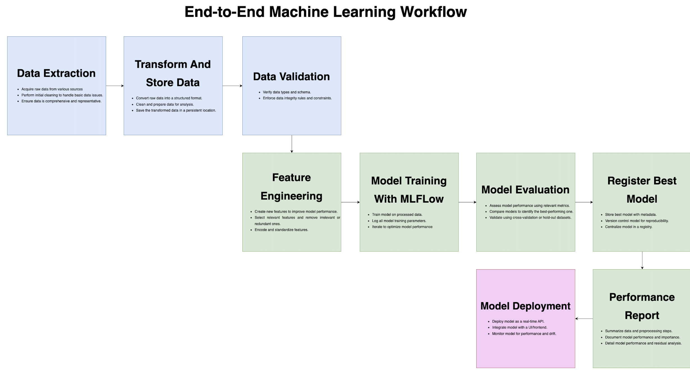

# End-to-end Sales Forecasting

## Table of Contents

<!-- TOC -->

- [End-to-end Sales Forecasting](#end-to-end-sales-forecasting)
  - [Table of Contents](#table-of-contents)
  - [Overview](#overview)
  - [Goals](#goals)
  - [High-level components](#high-level-components)
    - [Data Flow](#data-flow)
  - [Deployment & Runtime](#deployment--runtime)
    - [Bring up the stack dev](#bring-up-the-stack-dev)
  - [Airflow DAG details](#airflow-dag-details)

<!-- /TOC -->

## Overview

This project implements an end-to-end machine learning pipeline for weekly sales forecasting using synthetic data.

It leverages Apache Airflow for orchestration, MLflow for experiment tracking, and MinIO for artifact storage.

The solution is containerized using Docker and orchestrated with Docker Compose.



## Goals

- Provide an automated, reproducible ML training pipeline for weekly sales forecasting.
- Use Airflow to orchestrate data generation, validation, training, evaluation, and model registration.
- Track experiments in MLflow and persist artifacts to an S3-compatible store (MinIO).
- Package and deploy containerized services.
- Write modular, testable code for data processing and model training.
- Create APIs that can be reused in other projects.
- Create a simple frontend for visualizing forecasts.

## High-level components

- Airflow
  - Orchestrates DAGs and tasks. Uses CeleryExecutor with Redis and Postgres in the provided `docker-compose.yaml`.
  - DAGs live in `airflow/dags/` (e.g., `ml_dag.py`) and import project modules from the `include/` package.
  - Key DAG: `sales_forecast_training` in `airflow/dags/ml_dag.py` — generates data, validates it, trains models, evaluates, and (optionally) registers the best model.

- ML code and utilities
  - `include/ml/` contains model training code, e.g. `ModelTrainer` and helpers.
  - `include/utilities/` has support utilities: data generation, MLflow helpers, S3/MinIO helpers, and feature engineering.
  - `ml/` contains auxiliary scripts and diagnostic utilities used in experiments and local runs.

- Data and artifacts
  - `data/` stores generated and ingested datasets used by DAGs (mounted into the Airflow container).
  - `artifacts/` stores produced artifacts: trained models, encoders, scalers, and precomputed feature lists.
  - MLflow server persists run metadata to a Postgres DB (`mlflow-db`) and artifacts to MinIO (S3-compatible storage).

- Supporting infra (docker-compose)
  - `docker-compose.yaml` defines services used in local development:
    - `airflow-apiserver`, `airflow-scheduler`, `airflow-worker`, `airflow-triggerer`, `airflow-dag-processor`, `airflow-init`, `airflow-cli`
    - `airflow-db` (Postgres) as Airflow metadata DB
    - `redis` used by Celery
    - `mlflow` tracking server + `mlflow-db` (Postgres) for MLflow runs
    - `minio` for S3-compatible artifact storage and `minio-mc` helper to create buckets

### Data Flow

1. Data generation (Airflow task `extract_data_task`)
   - Uses `include.utilities.data_gen.RealisticSalesDataGenerator` to synthesize sales, promotions, traffic, and inventory parquet files into `data/`.

2. Data validation (`validate_data_task`)
   - Sample-based validation using pandas/pyarrow to ensure correctness, required columns and basic sanity checks.

3. Training (`train_models_task`)
   - Reads multiple parquet files using Polars, merges auxiliary datasets (promotions, traffic) and aggregates to daily and store-level series.
   - Uses `include.ml.trainer.ModelTrainer` to prepare data (feature engineering, splitting) and train multiple models (LightGBM, XGBoost, and an ensemble).
   - Training results and plots are logged to MLflow. Models and pickled artifacts are saved to the artifacts folder and to MinIO via MLflow artifact logging.

4. Evaluation and registration (`evaluate_models_task`, `register_best_model_task`)
   - Compare model metrics (RMSE and others) and identify the best-performing run.
   - Optionally register the best model to a model registry (via MLflow utilities).

## Deployment & Runtime

- Environment
  - The project relies on an `.env` file used by `docker-compose.yaml` (see top-level `.env` if present). Important env vars:
    - `AWS_S3_BUCKET`, `AWS_ACCESS_KEY_ID`, `AWS_SECRET_ACCESS_KEY` — used by MLflow/MinIO
    - MLflow DB and Airflow DB credentials are set in `docker-compose.yaml` environment blocks

- Ports (development)
  - Airflow web / API: `8080` (service `airflow-apiserver`)
  - MLflow: `5001` (service `mlflow`)
  - MinIO: `9000` (S3), console `9001`

### Bring up the stack (dev)

- Ensure `.env` contains the required secrets and settings.

- Start services with Docker Compose:

```bash
# from project root
docker compose up

# In detached mode:
docker compose up -d

# To view logs:
docker compose logs -f

# To stop:
docker compose down

# Stop and delete volumes (e.g., to reset Airflow DB):
docker compose down -v --remove-orphans
```

- Wait until DBs, MinIO and MLflow are healthy. `minio-mc` prepares the MLflow bucket automatically.

## Airflow DAG details

- Found in `airflow/dags/ml_dag.py`
- Schedule: `@weekly` (can be triggered manually via UI or CLI or adjusted in the DAG definition)
- Tasks (logical order):
  1. `extract_data_task` — generate and write parquet files into `data/`
  2. `validate_data_task` — sample-based validation and light checks
  3. `train_models_task` — prepare aggregated training frames and train models via `ModelTrainer`
  4. `evaluate_models_task` — post-training ranking and best-run identification
  5. `register_best_model_task` — (optional) register selected model

- DAG parameters (overrideable at runtime):
  - `max_files_to_process`, `validation_sample_size`, `enable_model_registration`, `data_start_date`, `data_end_date`
